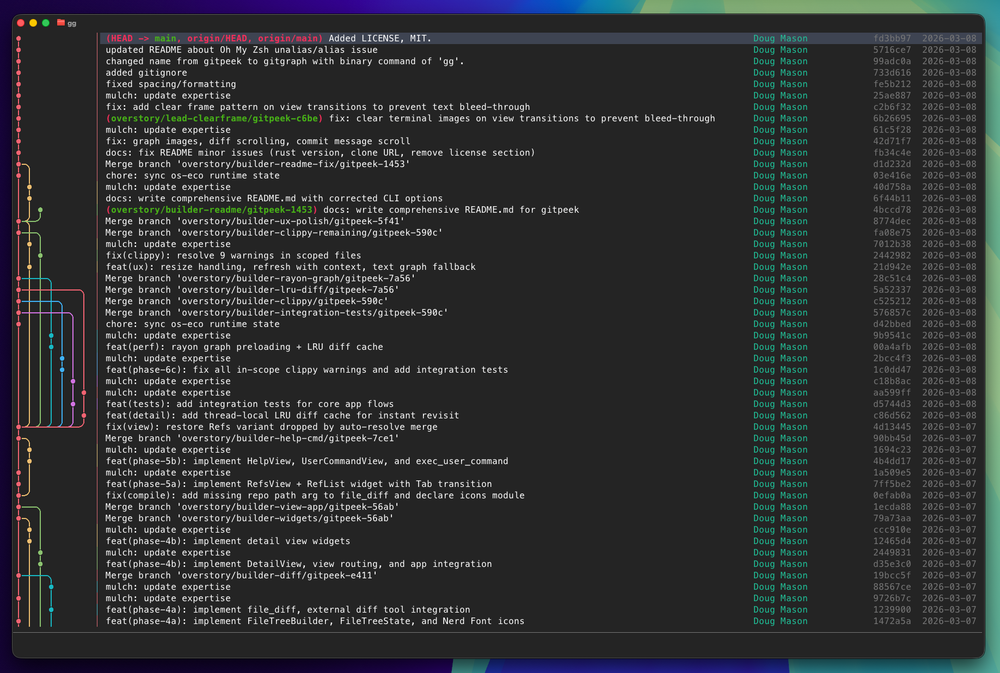
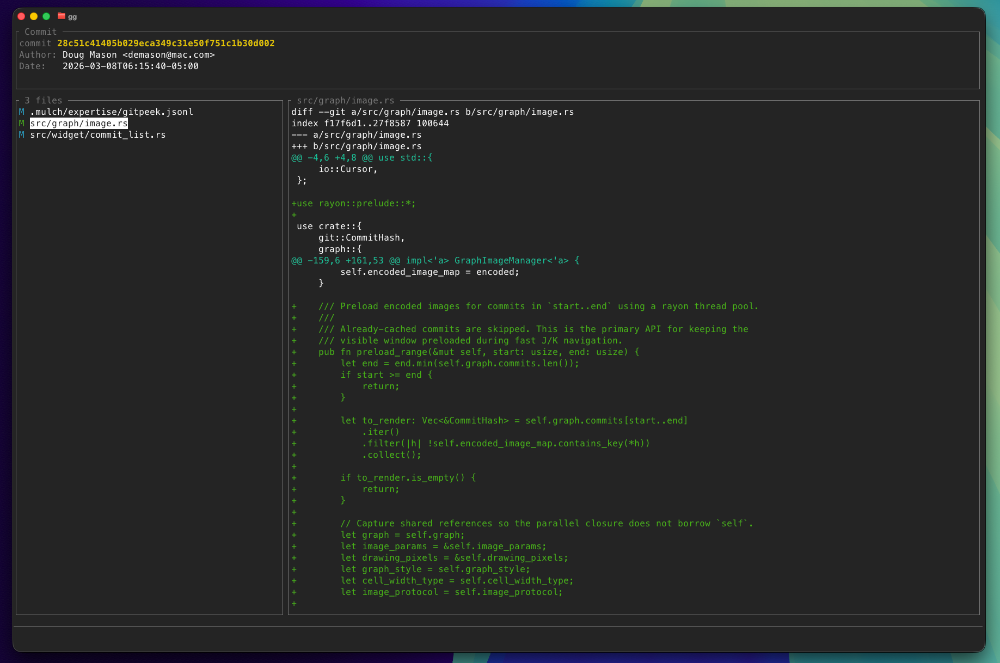

# gitgraph

> A terminal-based git commit explorer that combines image-based commit graphs with an interactive file tree diff viewer.

`gg` merges the best of two tools into one: browse a visual git log graph (like [serie](https://github.com/lusingander/serie)), select a commit, and explore its changes through a collapsible file tree with inline diffs (like [ftdv](https://github.com/dmacvicar/ftdv)) — without leaving the terminal.





```
┌─────────────────────────────────────────────────────────────┐
│ Graph │ ● │ Subject                       │ Author  │ Hash  │
│  ██   │   │ feat: add OAuth2 module       │ jdoe    │ a1b2c │
│  ██   │   │ fix: resolve token refresh    │ jdoe    │ 3d4e5 │
│  ██   │   │ Merge branch 'feature/auth'   │ alice   │ 6f7g8 │
├─────────────────────────────────────────────────────────────┤
│ Author:  John Doe <john@example.com>   Date: 2024-01-15     │
│ SHA:     a1b2c3d4e5f6  (HEAD → main)                        │
│                                                             │
│ feat: add OAuth2 module                                     │
├─────────────────────┬───────────────────────────────────────┤
│ File Tree           │ Diff Content                          │
│                     │                                       │
│ ├──  src/           │ @@ -10,6 +10,8 @@                     │
│ │   ├──  auth/      │  use crate::config;                   │
│ │   │   ├── mod.rs  │ +use crate::oauth;                    │
│ │   │   └── oauth…  │ +use crate::token;                    │
│ │   └── main.rs     │                                       │
│ ├──  tests/         │  fn main() {                          │
│ └── Cargo.toml      │ +    let client = OAuth::new();       │
│   +142 -23          │                                       │
└─────────────────────┴───────────────────────────────────────┘
```

## Features

- **Image-based commit graph** — renders high-quality curved branch lines via iTerm2 or Kitty image protocols; falls back to Unicode box-drawing characters in other terminals
- **Interactive file tree** — collapsible hierarchy with Nerd Font icons and per-file diff stats (`+N -M`)
- **Inline diff viewer** — syntax-colored diffs with vertical and horizontal scrolling; supports external tools like `delta` and `difftastic`
- **Refs browser** — tree view of branches, remotes, tags, and stashes; select any ref to jump to its commit
- **Vim-style navigation** — `j`/`k`, `g`/`G`, numeric prefixes (`5j`), half/full page jumps
- **Fuzzy search** — `/` to search commits with exact or fuzzy matching, case-insensitive toggle
- **User commands** — run configurable external commands with commit context (`{{target_hash}}`, `{{branches}}`, etc.)
- **Clipboard support** — copy short (`c`) or full (`C`) commit hash
- **TOML config** — fully configurable colors, keybindings, columns, and external tools
- **Refresh** — `R` to reload git data while preserving your current position

## Requirements

- Rust 1.70+ (for building from source)
- A terminal with [iTerm2](https://iterm2.com/) or [Kitty](https://sw.kovidgoyal.net/kitty/) image protocol support for graph images (optional — text graph fallback is available)
- [Nerd Fonts](https://www.nerdfonts.com/) for file icons (optional but recommended)
- Git 2.x

## Installation

### From source

```bash
# Clone or download the source
cd gitgraph
cargo install --path .
```

The binary is named `gg`.

> **Note for Oh My Zsh users:** The [git plugin](https://github.com/ohmyzsh/ohmyzsh/tree/master/plugins/git) aliases `gg` to `git gui citool`, which shadows this binary. To fix this, add one of the following to your `~/.zshrc` **after** `source $ZSH/oh-my-zsh.sh`:
>
> ```bash
> # Option 1: Remove the alias so the cargo-installed gg binary is used
> unalias gg 2>/dev/null
>
> # Option 2: Define your own alias
> alias gg='/path/to/.cargo/bin/gg'
> ```

## Usage

```bash
# Run in the current directory (must be a git repo)
gg

# Show all options
gg --help
```

`gg` always operates on the current working directory. `cd` into your repository before running.

### CLI Options

```
Usage: gg [OPTIONS]

Options:
      --order <ORDER>              Git log ordering [default: chrono] [possible values: chrono, topo]
      --graph-width <GRAPH_WIDTH>  Graph column width [default: auto] [possible values: auto, double, single]
      --graph-style <GRAPH_STYLE>  Graph rendering style [default: rounded] [possible values: rounded, angular]
      --protocol <PROTOCOL>        Terminal image protocol [default: auto] [possible values: auto, iterm, kitty]
  -h, --help                       Print help
  -V, --version                    Print version
```

All CLI options can also be set persistently in the [config file](#configuration).

## Views

### List View (default)

The main view: a scrollable commit log with the git graph on the left and configurable columns.

Press `Enter` on any commit to open the **Detail View**.

### Detail View

Shows the selected commit's metadata (author, date, SHA, parents, message) above a split panel:
- **Left panel** — collapsible file tree with diff stats per file (width configurable via `ui.detail.tree_width_percent`)
- **Right panel** — inline diff for the currently selected file

Navigate between commits with actions bound to `next_commit` / `prev_commit` without returning to the list. Press `q` or `Esc` to go back. Diff scrolling (`scroll_diff_down`, `scroll_diff_up`, etc.) and directory navigation (`toggle_directory`, `collapse_directory`) are available as configurable actions in the `[keybind]` section.

### Refs View (`Tab`)

A tree of all refs: local branches, remote branches, tags, and stashes. Press `Enter` on any ref to jump to that commit in the list.

### Help View (`?`)

Full-screen overlay showing all keybindings, organized by context. Dynamically reflects your configuration.

### User Command View (`d`)

Runs the configured user command (slot 1 by default; use numeric prefix `2d`, `3d`, etc. for other slots) and displays the captured output inline.

## Keybindings

### Global

| Key | Action |
|-----|--------|
| `q` | Quit / close view |
| `Ctrl-C` | Force quit |
| `?` | Toggle help |
| `Esc` | Cancel / close |
| `R` (Shift-R) | Refresh git data |

### List View

| Key | Action |
|-----|--------|
| `j` / `↓` | Navigate down |
| `k` / `↑` | Navigate up |
| `g` | Go to top |
| `G` | Go to bottom |
| `H` / `M` / `L` | Select top / middle / bottom of screen |
| `Ctrl-D` / `Ctrl-U` | Half page down / up |
| `Ctrl-F` / `Space` / `PageDown` | Page down |
| `Ctrl-B` / `PageUp` | Page up |
| `Ctrl-E` / `Ctrl-Y` | Scroll viewport down / up (selection stays) |
| `Shift-J` / `Shift-K` | Move selection + scroll |
| `Enter` | Open detail view |
| `Tab` | Open refs view |
| `/` | Start search |
| `n` / `N` | Next / previous match |
| `Ctrl-G` | Toggle case-insensitive search |
| `Ctrl-X` | Toggle fuzzy search |
| `Alt-j` | Jump to parent commit |
| `c` / `C` | Copy short / full hash |
| `d` | Run user command 1 |
| `1`–`9` | Numeric prefix (e.g., `5j` = move down 5) |

### Detail View

Detail view reuses the shared navigation bindings (`j`/`k`, `g`/`G`, etc.) to navigate the file tree. Additional detail-specific actions (`scroll_diff_down`, `scroll_diff_up`, `scroll_diff_page_down`, `scroll_diff_page_up`, `scroll_diff_left`, `scroll_diff_right`, `scroll_diff_fast_left`, `scroll_diff_fast_right`, `toggle_directory`, `collapse_directory`, `next_commit`, `prev_commit`) have no default keys and must be configured in `[keybind]`.

| Key | Action |
|-----|--------|
| `j` / `↓` | Navigate file tree down |
| `k` / `↑` | Navigate file tree up |
| `g` / `G` | First / last file |
| `c` / `C` | Copy short / full hash |
| `q` / `Esc` | Return to list view |

Example detail view keybind config:
```toml
[keybind]
scroll_diff_down      = ["e"]
scroll_diff_up        = ["y"]
scroll_diff_page_down = ["d"]
scroll_diff_page_up   = ["u"]
scroll_diff_left      = ["left"]
scroll_diff_right     = ["right"]
toggle_directory      = ["enter", "l"]
collapse_directory    = ["h"]
next_commit           = ["J"]
prev_commit           = ["K"]
```

### Refs View

| Key | Action |
|-----|--------|
| `j` / `↓` | Navigate down |
| `k` / `↑` | Navigate up |
| `g` / `G` | First / last ref |
| `Enter` | Jump to selected ref in commit list |
| `c` | Copy ref name |
| `Tab` / `q` / `Esc` | Close refs view |

## Configuration

The config file is loaded from (in order):
1. `$GITGRAPH_CONFIG_FILE` environment variable
2. `$XDG_CONFIG_HOME/gitgraph/config.toml`
3. `~/.config/gitgraph/config.toml`

All fields are optional — missing sections use defaults. A minimal config might look like:

```toml
[core]
graph_style = "rounded"   # "rounded" | "angular"
graph_width = "auto"      # "auto" | "double" | "single"
order       = "chrono"    # "chrono" | "topo"
protocol    = "auto"      # "auto" | "iterm" | "kitty"

[core.search]
ignore_case = false
fuzzy       = false

[core.diff]
# Pipe diffs through an external pager (e.g., delta, bat)
pager            = ""
external_command = ""
color_arg        = "always"

[ui.list]
columns          = ["Graph", "Marker", "Subject", "Name", "Hash", "Date"]
subject_min_width = 20
date_format      = "%Y-%m-%d"
date_width       = 10
date_local       = true
name_width       = 20

[ui.detail]
metadata_height    = 8
date_format        = "%Y-%m-%d %H:%M:%S"
date_local         = true
tree_width_percent = 20   # File tree panel width (%)

[ui.refs]
width = 26   # Refs panel width in columns

[ui.common]
cursor_type = "native"   # "native" | "virtual"

[graph.color]
branches = ["#E06C75", "#E5C07B", "#98C379", "#56B6C2", "#61AFEF", "#C678DD"]

[color]
diff_added       = "green"
diff_removed     = "red"
diff_hunk_header = "cyan"

[keybind]
# Override any default keybinding (replaces the entire entry)
# navigate_down = ["j", "down"]
# confirm       = ["enter"]
```

### Full TOML Schema

#### `[core]`

| Key | Type | Default | Values |
|-----|------|---------|--------|
| `order` | string | `"chrono"` | `"chrono"`, `"topo"` |
| `graph_width` | string | `"auto"` | `"auto"`, `"double"`, `"single"` |
| `graph_style` | string | `"rounded"` | `"rounded"`, `"angular"` |
| `initial_selection` | string | `"latest"` | `"latest"`, `"head"` |
| `protocol` | string | `"auto"` | `"auto"`, `"iterm"`, `"kitty"` |

#### `[core.search]`

| Key | Type | Default |
|-----|------|---------|
| `ignore_case` | bool | `false` |
| `fuzzy` | bool | `false` |

#### `[core.diff]`

| Key | Type | Default | Description |
|-----|------|---------|-------------|
| `pager` | string | `""` | Pager command (e.g. `"delta --side-by-side"`) |
| `external_command` | string | `""` | External diff driver (e.g. `"difft --color=always"`) |
| `color_arg` | string | `"always"` | `--color` arg passed to `git diff` |

#### `[core.user_command]`

| Key | Type | Default | Description |
|-----|------|---------|-------------|
| `tab_width` | usize | `4` | Tab stop width for command output display |
| `commands_1` … `commands_9` | table | — | User command definitions (see below) |

Each command definition:
```toml
[core.user_command.commands_1]
name     = "Diff"
type     = "inline"   # "inline" | "silent"
commands = ["git", "--no-pager", "diff", "--color=always",
            "{{first_parent_hash}}", "{{target_hash}}"]
```

**Template variables** (expanded per-commit at runtime):

| Variable | Expands to |
|----------|------------|
| `{{target_hash}}` | Full hash of the selected commit |
| `{{first_parent_hash}}` | Hash of the first parent commit |
| `{{parent_hashes}}` | All parent hashes (space-separated when inlined) |
| `{{refs}}` | All ref names attached to the commit |
| `{{branches}}` | Local branch names only |
| `{{remote_branches}}` | Remote branch names only |
| `{{tags}}` | Tag names only |
| `{{area_width}}` | Terminal area width (columns) |
| `{{area_height}}` | Terminal area height (rows) |

Standalone marker variables (`{{refs}}`, `{{branches}}`, `{{remote_branches}}`, `{{tags}}`, `{{parent_hashes}}`) expand into multiple argv elements so spaces in values are handled correctly.

#### `[ui.list]`

| Key | Type | Default | Description |
|-----|------|---------|-------------|
| `columns` | string[] | all 6 | `"Graph"`, `"Marker"`, `"Subject"`, `"Name"`, `"Hash"`, `"Date"` |
| `subject_min_width` | usize | `20` | Minimum width (chars) of Subject column |
| `date_format` | string | `"%Y-%m-%d"` | `chrono` format string |
| `date_width` | usize | `10` | Fixed width of Date column |
| `date_local` | bool | `true` | Display dates in local timezone |
| `name_width` | usize | `20` | Fixed width of Name column |

#### `[ui.detail]`

| Key | Type | Default | Description |
|-----|------|---------|-------------|
| `metadata_height` | usize | `8` | Rows for commit metadata panel |
| `date_format` | string | `"%Y-%m-%d %H:%M:%S"` | `chrono` format string |
| `date_local` | bool | `true` | Display dates in local timezone |
| `tree_width_percent` | usize | `20` | File tree panel width (%) |

#### `[ui.refs]`

| Key | Type | Default |
|-----|------|---------|
| `width` | usize | `26` |

#### `[ui.common]`

| Key | Type | Default | Values |
|-----|------|---------|--------|
| `cursor_type` | string | `"native"` | `"native"` (terminal cursor), `"virtual"` (renders `>`) |

### External Diff Tools

gitgraph supports two integration modes for external diff tools:

**Pager mode** — diff content is piped to the tool's stdin:
```toml
[core.diff]
pager = "delta --side-by-side"
```

**External diff mode** — tool is set as git's `diff.external`:
```toml
[core.diff]
external_command = "difft --color=always"
```

When both are set, `external_command` takes precedence. Template variables `{{width}}` and `{{columnWidth}}` (half of `{{width}}`) are available in both commands.

### Protocol Detection

gitgraph auto-detects whether your terminal supports iTerm2 or Kitty image protocols. To force a specific protocol:

```toml
[core]
protocol = "iterm"   # "auto" | "iterm" | "kitty"
```

If neither protocol is detected, gitgraph renders the graph using Unicode box-drawing characters.

### Graph Style

```toml
[core]
graph_style = "rounded"   # Bezier arcs for branch curves
# graph_style = "angular" # Sharp 45° corners
```

## Architecture

gitgraph is written in Rust and uses [ratatui](https://ratatui.rs/) for the TUI. All git interaction shells out to the system `git` binary — no libgit2. This keeps the binary small and leverages the user's existing git configuration (aliases, signing, etc.).

### Key modules

| Module | Purpose |
|--------|---------|
| `src/git/` | Repository loading, commit/ref parsing, diff generation |
| `src/graph/` | Lane-based graph layout algorithm, PNG image rendering, text graph fallback |
| `src/view/` | View state machine (List, Detail, Refs, Help, UserCommand) |
| `src/widget/` | Ratatui widgets (CommitList, FileTree, DiffViewer, RefList) |
| `src/tree/` | File tree builder and Nerd Font icon map |
| `src/config.rs` | TOML config loading with defaults |
| `src/keybind.rs` | Keybinding system (defaults + user overrides) |
| `src/external.rs` | Pager, external diff, user command execution |
| `src/color.rs` | Color theme and graph color set |

## Comparison

| Feature | serie | ftdv | gitgraph |
|---------|-------|------|---------|
| Commit graph (image-based) | ✓ | — | ✓ |
| File tree diff view | — | ✓ | ✓ |
| Inline diff viewer | — | ✓ | ✓ |
| External pager support | — | ✓ | ✓ |
| External diff driver | — | ✓ | ✓ |
| Refs browser | ✓ | — | ✓ |
| Fuzzy search | ✓ | — | ✓ |
| Clipboard | ✓ | — | ✓ |
| User commands | ✓ | — | ✓ |
| Nerd Font icons | — | ✓ | ✓ |
| Config format | TOML | YAML | TOML |

